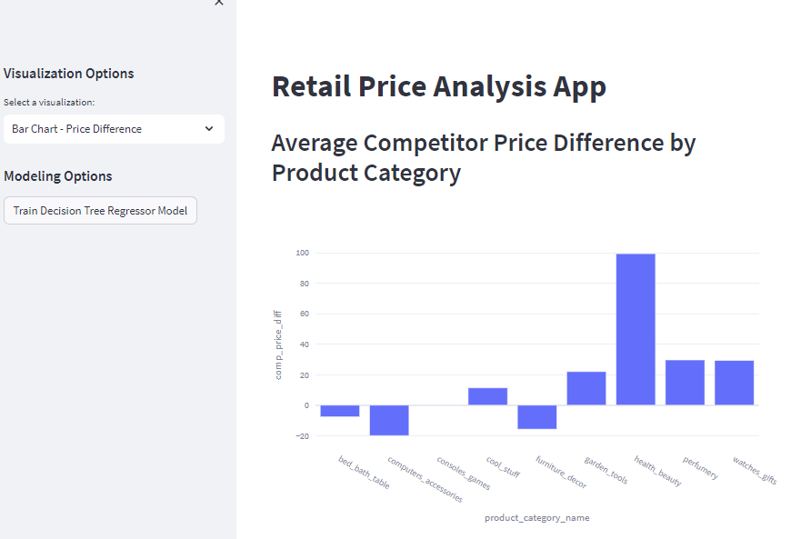
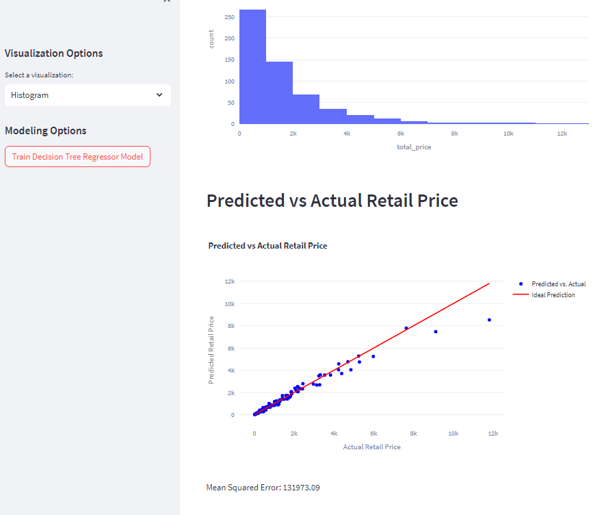

# Retail Price Analysis App

This is a Streamlit web application for analyzing retail prices and training a Decision Tree Regressor model to predict prices based on various features.

## Getting Started




### Prerequisites

- Python 3.6+
- Streamlit: Install it using `pip install streamlit`
- Pandas: Install it using `pip install pandas`
- Plotly: Install it using `pip install plotly`
- Scikit-learn: Install it using `pip install scikit-learn`

### Installation

1. Clone this repository:

```bash
   git clone https://github.com/Mohshaikh23/Retail-Price-Optimization.git
   cd retail-price-analysis-app
```

Install the required dependencies:

```bash
pip install -r requirements.txt
```

Usage
Place your dataset named retail_price.csv in the root directory of the project.

Run the Streamlit app using the following command:

```bash
streamlit run app.py
```

The app will open in your default web browser, allowing you to select visualizations and train the Decision Tree Regressor model.

Features
Choose from various visualizations such as histograms, box plots, scatter plots, and more.
Train and visualize the performance of a Decision Tree Regressor model.
Contributing
Contributions are welcome! Please feel free to fork this repository and submit pull requests.

License
This project is licensed under the MIT License.

For more information on Streamlit, visit the 

For more information on Plotly, visit the  

For more information on Scikit-learn, visit the 